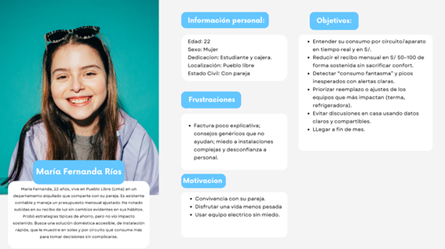
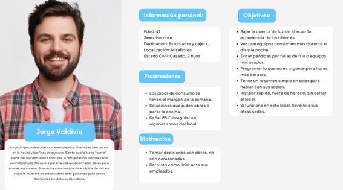
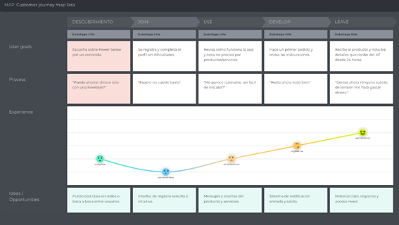
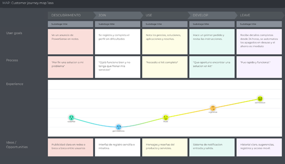
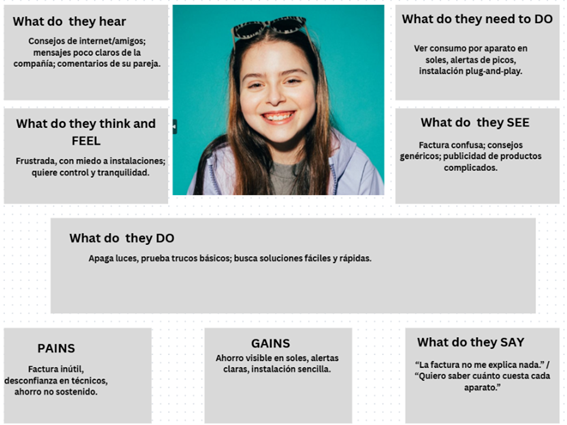
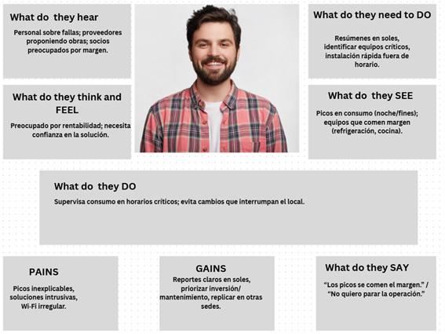
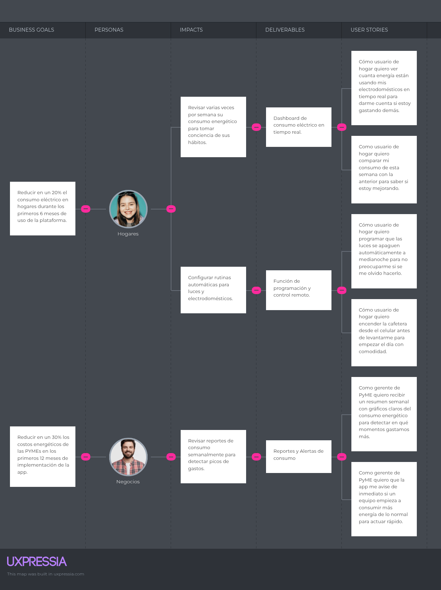
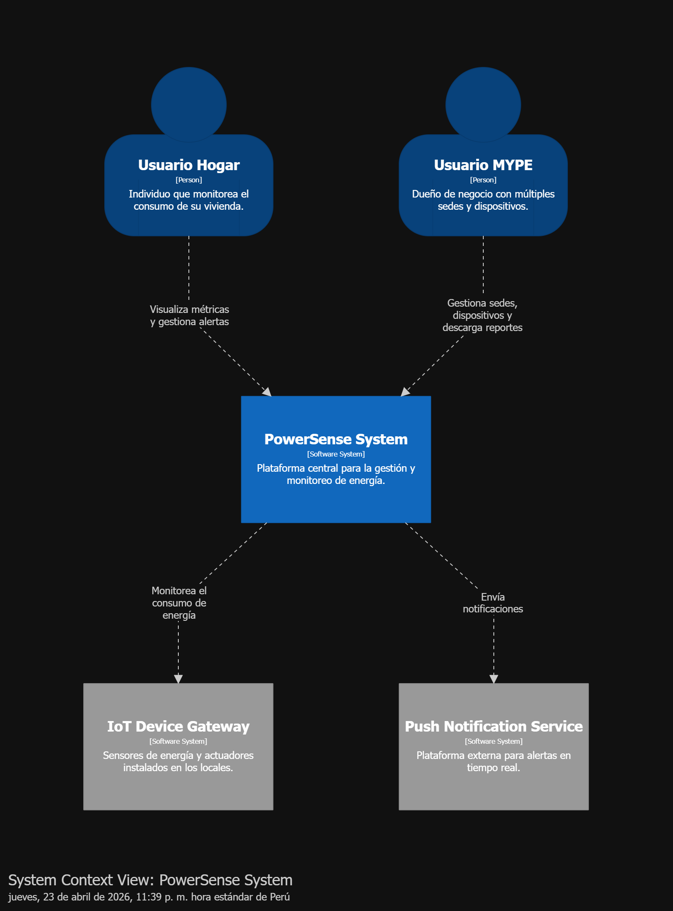
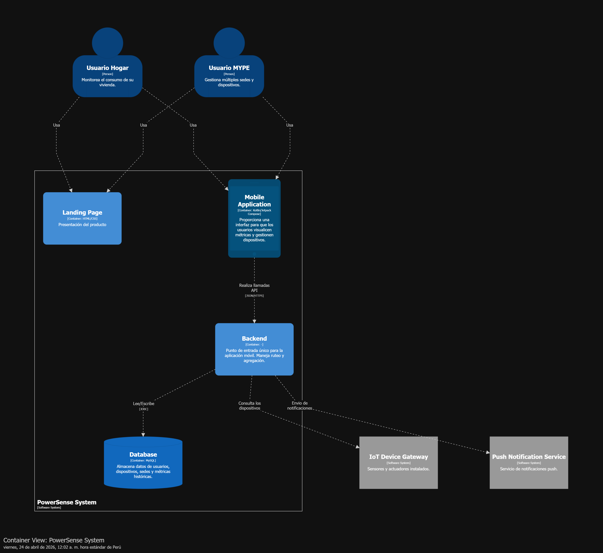
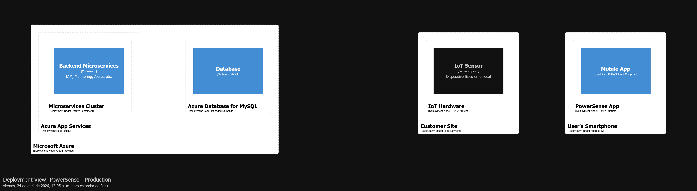

# Capítulo II: Requirements Development and Software Solution Design

## 2.1. Competidores
A continuacion, se presenta una tabla que contiene a los competidores mas relevantes para nuestra IoS (IoT + Software/IA para monitoreo y optimización del consumo eléctrico).
| id | Nombre | Descripcion | Caracteristicas | Distribucion | Logo |
| :--- | :--- | :--- | :--- | :--- | :--- |
| 1 | Smelpro | - Soluciones IoT e Inteligencia Artificial para Industria 4.0.   - Aplicaciones energéticas: monitoreo en tiempo real, detección de fallas, optimización de los costos operativos y mantenimiento predictivo.   - Sectores: manufactura, logística, minería, energía y agua. | - Monitoreo del consumo electrico en tiempo real.   - Detección de fallas y mantenimiento predictivo con uso de I.A.   - Optimización de los costos operativos.   - Soporte para LoRaWAN, Sigfox y redes celulares.   - Dashboards personalizados| - Ventas B2B directas.  - Integradores y proyectos llave en mano	 |  |
| 2 | LoraTech | - Empresa líder en soluciones IoT con tecnología LoRaWAN para monitoreo energético.   - Aplicaciones eléctricas: redes de sensores para medir el consumo eléctrico en tiempo real, control remoto de cargas, alertas y reportes para optimización.   - Ventajas: bajo consumo, alta penetración en interiores y seguridad de los datos.   - Sectores: industria, agroindustria y edificios inteligentes. | - Redes de sensores LoRaWAN para consumo en tiempo real.   - Alertas y reportes de anomalías y consumo.   - Dispositivos de bajo consumo y larga autonomía.   - Control remoto de cargas y automatización. | - Ventas B2B y partners integradores.   - Proyectos llave‑en‑mano y proveedores de gateways/servicios de red. |  |
| 3 | Teca Perú | - Soluciones “llave‑en‑mano” en telemetría y telecontrol con fuerte uso de LoRaWAN.   - Aplicaciones energéticas: medición en tiempo real de servicios (agua, energía, gas) y despliegues industriales.   - Casos: edificios inteligentes, minería, agricultura, piscicultura. | - Telemetría y telecontrol llave‑en‑mano.   - Redes LoRaWAN privadas y gateways.   - Medición en tiempo real y dashboards industriales.   - Integración con sistemas SCADA/ERP. | - Ventas B2B directas.   - Integradores de proyectos y contratos con empresas/municipios. |  |

### 2.1.1. Análisis competitivo
| **Propósito del análisis:** Evaluar la posición de PowerSense frente a sus tres competidores clave del ecosistema IoT/energía (Smelpro, LoraTech y Teca Perú) para identificar ventajas competitivas, riesgos y tácticas prioritarias que permitan ganar cuota en hogares urbanos y PYMEs. |
| **Pregunta guía:** ¿Cómo se compara PowerSense en oferta, producto, mercado y potencial estratégico frente a Smelpro, LoraTech y Teca Perú, y qué acciones tácticas deben priorizarse para diferenciarse y crecer? |
### 2.1.2. Estrategias y tácticas frente a competidores
| Categoría | Detalle | PowerSense (objetivo) | Smelpro | LoraTech | Teca Perú |
| :--- | :--- | :--- | :--- | :--- | :--- |
| **Perfil** | **Overview** | *Plataforma IoT + IA* orientada a hogares y PYMEs: kits plug‑and‑play por circuito, app móvil/panel web, analítica que traduce consumo a ahorro en S/; modelo freemium + suscripción. | *Proveedor de soluciones industriales* IoT/IA centrado en monitoreo, mantenimiento predictivo y optimización operativa en entornos críticos. | *Proveedor e integrador LoRaWAN* especializado en despliegues de red, sensores y gestión para sensorización masiva y baja potencia. | *Integrador local* de telemetría y telecontrol que entrega proyectos llave‑en‑mano, con experiencia en integración SCADA/ERP y contratos sectoriales. |
| **Perfil** | **Ventaja Competitiva** | Ahorro económico claro (S/), IA explicable que sugiere acciones prácticas y UX sencilla para usuarios no técnicos; rápida adopción mediante freemium. | Analítica avanzada y experiencia en entornos industriales críticos; soluciones robustas para uptime y eficiencia operativa. | Cobertura LoRaWAN, eficiencia en consumo energético de sensores y escalabilidad para despliegues masivos. | Entrega integral: hardware, instalación, integración y operación; conocimiento del mercado local y normativas. |
| **Perfil de marketing** | **Mercado objetivo** | Hogares urbanos (nivel medio‑alto) y pequeñas/medianas empresas (PYMEs) que buscan reducir su recibo eléctrico y mejorar eficiencia sin complejidad técnica. | Grandes industrias: minería, manufactura, plantas con requerimientos críticos. | Operadores de red, edificios inteligentes, agricultura, municipalidades y empresas que requieren sensorización masiva. | Empresas locales, municipalidades y proyectos sectoriales (energía, agua, minería) que requieren soluciones integradas. |
| **Perfil de marketing** | **Estrategias de marketing** | Marketing digital orientado a ahorro (casos en S/), pilotos locales, partnerships con instaladores y campañas de conversión freemium→pago. | Relaciones B2B, participación en ferias industriales, estudios de caso técnicos y ventas consultivas. | Alianzas con operadores LoRaWAN, demostraciones de cobertura y campañas sectoriales (agro, smart cities). | Licitaciones, relaciones comerciales locales, propuestas llave‑en‑mano y presencia en contratos públicos/privados. |
| **Perfil de producto** | **Productos o servicios** | Kits de medición por circuito (pinzas/medidores), gateway Wi‑Fi/LoRa, app móvil/panel web, analítica IA, reportes de ahorro y alertas. | Sensores industriales, gateways, plataforma analítica, mantenimiento predictivo y servicios de integración a sistemas de control. | Gateways LoRaWAN, nodos/sensores, gestión de red, integraciones y servicios gestionados para despliegues. | Sensores, gateways, integración SCADA/ERP, servicios de instalación, puesta en marcha y operación. |
| **Perfil de producto** | **Precios y costos** | Estimado: hardware S/200–S/600 por kit; suscripción S/9–S/49/mes según plan. Instalación opcional con cargo único. | Modelos de proyecto: contratos de alto valor (decenas de miles S/); soporte/servicios bajo contrato anual. | Venta de hardware + tarifas por gestión/servicio; precio variable según escala y cobertura. | Precios por proyecto (CAPEX) y contratos de servicio; altos montos según alcance e integración requerida. |
| **Perfil de producto** | **Canales de distribución** | E‑commerce para kits, app móvil y web para servicio; red de instaladores certificados y partnerships B2B. | Ventas B2B directas, integradores, licitaciones y servicios profesionales. | Partners/operadores LoRaWAN, integradores y distribuidores; portales B2B para gestión de red. | Ventas B2B, integradores locales, canales de licitación pública y contratos corporativos. |
| **Análisis SWOT** | **Fortalezas** | - Enfoque en usuario final y PYMEs - IA explicable con métricas en S/ - Modelo freemium que facilita adopción rápida | - Analítica y capacidades probadas en entornos críticos - Credibilidad en industria - Soluciones robustas y escalables | - Experiencia y know‑how en LoRaWAN - Bajo consumo y buena penetración para sensores - Capacidad de despliegue masivo | - Capacidad de entrega integral (instalación + integración) - Conocimiento del mercado local y normativas - Relaciones con clientes públicos/privados |
| **Análisis SWOT** | **Debilidades** | - Marca nueva: menor confianza inicial - Recursos limitados frente a incumbentes - Dependencia inicial de partners para instalación/soporte | - Enfoque industrial puede limitar atractivo para consumidores residenciales - Costos y complejidad altos | - Depende de cobertura y planificación de red - No siempre óptimo para soluciones plug‑and‑play residenciales | - Ciclos de venta largos - Dependencia en contratos/licitaciones que generan variabilidad |
| **Análisis SWOT** | **Oportunidades** | - Creciente preocupación por ahorro energético doméstico - Alianzas con instaladores, municipalidades y utilities - Pilotos que prueben ROI local en S/ | - Digitalización industrial y demanda de mantenimiento predictivo | - Expansión de redes LoRaWAN gestionadas y demanda de sensorización masiva | - Proyectos públicos/privados en modernización y telemetría regional |
| **Análisis SWOT** | **Amenazas** | - Entrada de ESCOs o utilities con ofertas financiadas - Competidores con soluciones ya integradas en PYMEs - Cambios regulatorios que afecten despliegues | - Competencia con soluciones más accesibles para PYMEs/residenciales - Proveedores globales con mayor escala | - Proveedores que usan Wi‑Fi o redes celulares para mercados residenciales - Competencia de integradores locales | - Presión de precio en licitaciones y entrada de integradores internacionales |
## 2.2. Entrevistas
### 2.2.1. Diseño de entrevistas

Para evaluar el atractivo y la practicidad de el servicio y producto PowerSense , estamos realizando entrevistas para entender a fondo lo que nuestros futuros usuarios necesitan, cómo se comportan y qué esperan.

### Diseño de entrevista – Primer segmento objetivo (Hogar):

¿En qué momentos del día suele usar más electricidad?

¿Qué dispositivos eléctricos son indispensables en su hogar y por qué?

¿Ha sentido que paga más luz de lo que debería? ¿Cómo lo percibe?

¿Suele comparar el monto de su recibo actual con el de meses anteriores? ¿Qué observa en esas comparaciones?

¿En su hogar suelen hablar o discutir sobre el gasto en electricidad?

¿Ha tenido que limitar el uso de algún aparato eléctrico por el costo de la electricidad?

¿Qué estrategias usa actualmente para intentar reducir el gasto en electricidad?

¿Cómo se informa (si es que lo hace) sobre su consumo eléctrico?

¿Qué impacto tiene el gasto en electricidad dentro del presupuesto familiar?

### Diseño de entrevista – Segundo segmento objetivo (Negocios):

¿Cuál es su nombre y cargo dentro de la empresa?

¿Cómo se llama su negocio y a qué rubro se dedica (ej. comercio, gastronomía, servicios, manufactura, etc.)?

¿En qué distrito o zona se encuentra ubicada su empresa?

¿Cuántos años tiene funcionando su negocio?

¿Cuál es el horario de funcionamiento habitual de su negocio?

¿En qué meses del año siente que gasta más electricidad? ¿Por qué cree que ocurre eso?

¿Qué equipos o procesos consumen más energía en su operación diaria?

¿Qué equipos, maquinarias o procesos son más indispensables para su negocio?

¿Qué equipos cree que consumen más energía?

¿Han tenido fallas en los equipos o servicios debido a picos de consumo eléctrico?

¿Qué estrategias o medidas ha probado para reducir el gasto en electricidad?

¿Cómo afecta el pago de la electricidad en su rentabilidad mensual o anual?

¿Considera que sus clientes valoran si su empresa adopta prácticas sostenibles?

¿Qué impacto tendría en su negocio poder optimizar los recursos energéticos sin sacrificar productividad?

### 2.2.2. Registro de entrevistas

### - Segmento objetivo 1 (Hogares)

Entrevista 1 (Cameron Bustamante) Inicio: 00:00 - Fin: 02:37 - Duración: 2:37

  

- Nombre: Cameron Bustamente
- Edad: 22 años
- Distrito de residencia: Surco

Resumen de Entrevista : A partir de la entrevista realizada al usuario Cameron Bustamante, de 22 años y residente de Surco, se identificó que el entrevistado describe su rutina diaria y cómo ésta se refleja en el consumo eléctrico del hogar. Indica que por las mañanas utiliza la cocina y la terma y por las noches enciende la televisión y varios dispositivos electrónicos, generando picos marcados en esos horarios. 

Señala que la nevera permanece siempre encendida y constituye un consumo base, pero que la boleta ha aumentado con el tiempo sin una explicación aparente; comenta que no ha incorporado nuevos electrodomésticos ni cambiado hábitos de forma relevante. Manifiesta frustración por la falta de desagregación en la factura y por no poder identificar qué aparatos o qué franjas horarias generan los picos. Expone que sus medidas de ahorro son básicas (desenchufar equipos en desuso, duchas más cortas) y reconoce no conocer el impacto real de estas acciones en el monto final. 

Finaliza expresando interés en una solución que muestre consumo por toma y envíe alertas ante picos inusuales para recuperar control y tranquilidad.

Link de la entrevista:

Entrevista 2 (Zuriel Rivera) Inicio: 00:00 - Fin: 7:25 - Duración: 7:25

  

- Nombre: Zuriel Rivera
- Edad: 19 años
- Distrito de residencia: Surquillo

Resumen de la entrevista: En esta entrevista se le pregunto a Zuriel Andrea Rivera, una residente de Surquillo, que opiniones tenía con respecto al consumo eléctrico que había a nivel de hogar. 

Entre las preguntas que se le hizo, hubieron varias referentes al tipo de dispositivos que se utilizan, el momento del día donde se utilizan más aparatos eléctricos o el impacto económico que llega a tener para los habitantes de la vivienda llegando a señalar puntos como el uso de dispositivos eléctricos esenciales ya sea el microondas, el nodo del internet, la televisión, las diversas computadoras que hay en casa o el cargador de los celulares.

Sus respuestas confirmaron las hipotesis que planteabamos con respecto a ese tipo de problemática, por lo cual tomamos en consideración los diversos puntos que señalo para implementarlos en el producto final del proyecto.

Link de la entrevista: https://upcedupe-my.sharepoint.com/:v:/g/personal/u202210104_upc_edu_pe/IQB3d49pgoprQZ0Sn74770w4AWW4A5ob_o-Wv5YtxuwFkYQ?e=Xv93lv&nav=eyJyZWZlcnJhbEluZm8iOnsicmVmZXJyYWxBcHAiOiJTdHJlYW1XZWJBcHAiLCJyZWZlcnJhbFZpZXciOiJTaGFyZURpYWxvZy1MaW5rIiwicmVmZXJyYWxBcHBQbGF0Zm9ybSI6IldlYiIsInJlZmVycmFsTW9kZSI6InZpZXcifX0%3D

Entrevista 3 (Nombre aqui)

### - Segmento objetivo 2 (Negocios)

Entrevista 4 (Juan Carlos Urdanivia Abad — Premium Cultural Institute) Inicio: 10:13 - Fin: 16:18 - Duración: 6:05

  

- Nombre: Juan Carlos Urdanivia Abad
- Edad: 55 años
- Distrito de residencia: Surco
- Sector: Enseñanza

Resumen de Entrevista : A partir de la entrevista realizada al usuario Juan Carlos Urdanivia Abad, de 55 años y residente de Surco, se identificó que desde la perspectiva institucional los equipos de climatización y los sistemas audiovisuales generan picos significativos, especialmente durante actividades y temporadas altas. 

Indica que las vitrinas o equipos que requieren funcionamiento continuo representan la carga base más relevante y que la falta de datos en tiempo real impide identificar con precisión horarios o procesos causantes de incrementos en la factura. Manifiesta interés en monitoreo por circuito, reportes estacionales y en justificar inversiones en eficiencia ante la dirección, pero también subraya la necesidad de garantizar continuidad de servicio y comodidad en el espacio educativo.

Link de la entrevista:

Entrevista 5 (Nombre aqui)

Entrevista 6 (Nombre aqui)

### 2.2.3. Análisis de entrevistas

### - Segmento objetivo 1 (Hogares):

Observamos que los entrevistados reportan incrementos periódicos en el gasto energético sin que se identifique una causa clara y verificable que explique dichas variaciones. Los datos que reciben, como la boleta y las lecturas del medidor, no son suficientemente detallados ni intuitivos para relacionarlos con el uso real de los equipos, lo que genera desconfianza y sensación de opacidad. Además, existe escasa formación en gestión energética: muchos participantes reconocen no tener conocimientos técnicos para interpretar consumos eléctricos ni para evaluar estrategias de ahorro más sofisticadas. Las medidas que aplican suelen ser reactivas y de bajo impacto.

Por ejemplo, desenchufar equipos o reducir tiempos de ducha y carecen de herramientas que permitan medir su efecto a mediano o largo plazo. En viviendas compartidas aparece un problema recurrente en la distribución del costo: la ausencia de mediciones por toma o por usuario provoca incertidumbre y conflictos al momento de repartir la boleta.

### - Segmento objetivo 2 (Negocios):

Los entrevistados reconocen que el consumo es elevado y que existen picos asociados a equipos concretos, como refrigeradores y aires acondicionados, pero coinciden en que no siempre es posible identificar con precisión qué operación o qué horario provoca los incrementos en la factura. La información disponible no facilita la toma de decisiones operativas porque falta métricas en tiempo real y reportes que permitan optimizar horarios y equipos.

Aunque hay interés en implementar medidas de eficiencia o generación propia, la principal barrera es el costo inicial y la necesidad de justificar retornos financieros claros, lo que impide muchas veces la adopción. La prioridad de estos negocios es garantizar la continuidad operativa: en rubros con equipos críticos (congeladores, vitrinas, equipos de ventilacion), la posibilidad de aplicar medidas agresivas de reducción de carga queda limitada por el riesgo de pérdidas, por lo que requieren soluciones que les permitan monitorear y proteger esos activos. Las prácticas actuales de gestión energética son en general manuales y poco automatizadas, lo que reduce la capacidad de respuesta eficiente ante variaciones de demanda.

## 2.3. Needfinding
### 2.3.1. User Personas

#### Segmento 1 (Hogares)

  

#### Segmento 2 (Negocios)

  

### 2.3.2. User Task Matrix

  **Segmento 1: Hogares** 
| Tarea principal                                                     | Frecuencia | Importancia |
|---------------------------------------------------------------------|------------|-------------|
| Instalar la app de PowerSense de forma rápida y segura y sin complicaciones     | Una vez    | Alta        |
| Abrir la app y ver el consumo energético en tiempo real      | Frecuente  | Alta        |
| Recibir alertas de picos/anomalías en el consumo energético y entender qué hacer             | Frecuente  | Alta        |
| Recibir alertas de sobrecalentamiento de dispositivos y entender qué hacer             | Frecuente  | Alta        |
| Control remoto de dispositivos para facilitar la activación o desactivación de estos | Frecuente |Media|

---

 **Segmento 2: PYME**

| Tarea principal                                                             | Frecuencia | Importancia |
|-----------------------------------------------------------------------------|------------|-------------|
| Desplegar PowerSense fuera de horario sin parar operación                   | Una vez    | Alta        |
| Monitorear circuitos/equipos críticos en tiempo real (en S/ por hora)       | Frecuente  | Alta        |
| Revisar reporte mensual sobre el consumo energético calculado para cada departamento (branch)                    | Frecuente  | Alta        |
| Control remoto de dispositivos dentro de un departamento completo de forma rápida             | Frecuente  | Media|

### 2.3.3. User Journey Mapping

#### Journey Map - Segmento 1 (Hogares):

  

#### Journey Map - Segmento 2 (Negocios):

  

### 2.3.4. Empathy Mapping

#### Empathy Mapping - Segmento 1 (Hogares)

  

#### Empathy Mapping - Segmento 2 (Negocios)

  

### 2.3.5. Big Picture EventStorming

En esta sección se detalla el desarrollo del Big Picture Event Storming, una técnica colaborativa orientada a explorar el dominio de nuestro negocio de manera integral. A través de este proceso identificamos los Domain Events más significativos y los organizamos cronológicamente para visualizar la linea de vida del sistema. Este enfoque no solo nos permitió mapear los flujos de la aplicación, sino también establecer un Lenguaje Ubicuo común entre el equipo y detectar tempranamente cuellos de botella u oportunidades de optimización en la gestión energética de hogares y MYPES.

### 2.3.6. Ubiquitous Language

Para esta sección se planteó un diccionario de términos técnicos que son aplicados en el dominio de nuestro proyecto.

| Término | Definición|  
|---|---|  
| **Consumo Energético(Energy Consumption)** | Consumo de energía calculado según los parametros de la potencia y el tiempo de uso.|
| **Usuario (User)** | Persona con una cuenta registrada en la app. Usada para la autenticación. |  
| **Campo de Especialidad (Branch)** | Área técnica en la que se especializa el trabajador (ej. RR. HH. o TI). |  
| **Dispositivo (Device)** | Dispositivo IoT conectado a la aplicación para su gestión y monitoreo.| 
| **Umbral (Treshold)** | Límite de consumo de energía que se tiene previsto según el sistema.| 
| **Programación (Schedule)** | Horarios predefinidos para la activación y desactivación remota y automática de los dispositivos| 
| **Reporte (Report)** | Informe que muestra un resumen del consumo energético mediante gráficos o descripciones numéricas.|
| **Alerta (Alert)** | Notificaciones de alerta cuando se excede el umbral de consumo energético o se detecta el sobrecalentamiento de un dispositivo.|

## 2.4. Requirements specification
### 2.4.1. User Stories

### Epic 1 – Landing Page
| #HU  | HU ID | Tipo Usuario    | Nombre HU               | Descripción                                                                                                                                                   | Criterios de Aceptación    |
|------|-------|-----------------|-------------------------|---------------------------------------------------------------------------------------------------------------------------------------------------------------|------------------------------------------------------------------------------------------------------------------------------------------------------------------------------------------------------------------------------------------------------------------------------------------------------------------------------------------------------------------------------------------------------------------------------------------------------------------------------------------------------------------------------------|
| HU1 | HU1  | Visitante Hogar | Información general del producto | Como visitante interesado en reducir el consumo energético en mi hogar, quiero acceder a información clara sobre la plataforma de optimización energética para entender cómo me beneficia y cómo puede ayudarme a ahorrar en mis facturas. | **Scenario 1: Acceso a información pública** Dado que el visitante ingresa a la página web de la plataforma de optimización energética Cuando selecciona la sección “Información del producto” Entonces el sistema muestra una descripción general de la plataforma, sus objetivos (ahorro de energía y optimización de consumo) y los beneficios principales como monitoreo en tiempo real y dispositivos inteligentes.  **Scenario 2: Visualización de funcionalidades** Dado que el visitante se encuentra en la sección “Información del producto” Cuando navega por la interfaz Entonces el sistema presenta de manera clara las funcionalidades, como el monitoreo de consumo, los reportes de energía y las alertas para optimizar el uso de energía en el hogar.  **Scenario 3: Recomendaciones para ahorrar energía** Dado que el visitante revisa la información sobre el producto Cuando llega a la sección de consejos o recomendaciones de ahorro energético Entonces el sistema muestra sugerencias simples, como la optimización del uso de dispositivos y consejos para reducir el consumo sin necesidad de personalización.  **Scenario 4: Llamada a la acción** Dado que el visitante explora la información general Cuando visualiza botones o enlaces destacados como “Ver cómo funciona” o “Ver planes” Entonces el sistema muestra opciones para registrarse, iniciar sesión o solicitar más información sobre los planes y servicios de optimización energética. |
| HU2 | HU2  | Visitante Hogar | Casos de éxito            | Como visitante, quiero consultar casos de éxito reales sobre ahorro energético en hogares para confiar en la efectividad de la solución antes de registrarme. | **Scenario 1: Acceso público** Dado que el visitante ingresa a la plataforma sin necesidad de estar registrado Cuando selecciona la sección “Casos de éxito” Entonces el sistema muestra una lista de testimonios e implementaciones exitosas en hogares.  **Scenario 2: Visualización detallada** Dado que el visitante se encuentra en la lista de casos de éxito Cuando selecciona un caso específico Entonces el sistema muestra información detallada sobre el consumo energético antes y después de utilizar la plataforma, así como los resultados obtenidos, como reducción de costos y optimización de consumo.  **Scenario 3: Filtrado por tipo de usuario** Dado que el visitante accede a la sección de casos de éxito Cuando utiliza el filtro “Hogar” Entonces el sistema muestra únicamente los casos correspondientes a usuarios de tipo hogar.  **Scenario 4: Llamada a la acción** Dado que el visitante ha revisado uno o más casos de éxito Cuando llega al final de la página Entonces el sistema muestra un botón destacado para registrarse o solicitar más información sobre la plataforma. |
| HU3 | HU3  | Visitante Hogar | Planes y precios           | Como visitante interesado en optimizar el consumo energético de mi hogar, quiero visualizar los planes y precios para elegir la opción que se ajuste a mis necesidades. | **Scenario 1: Acceso a la sección de planes** Dado que el visitante se encuentra en la página principal Cuando selecciona la opción “Planes y precios” en el menú de navegación Entonces el sistema muestra una tabla comparativa con los diferentes planes disponibles: Básico (Gratis), Pro ($29/mes), y Empresarial ($79/mes).  **Scenario 2: Visualización de características** Dado que el visitante accede a la tabla de planes Cuando revisa la comparativa Entonces el sistema muestra de manera clara las características de cada plan, como el monitoreo básico de consumo, análisis avanzado de consumo, y soporte prioritario.  **Scenario 3: Plan destacado** Dado que la plataforma ofrece un plan recomendado Cuando el visitante observa la comparativa Entonces el sistema resalta visualmente el plan más popular o recomendado (Ejemplo: con un borde o etiqueta “Más Popular”).  **Scenario 4: Selección de plan** Dado que el visitante identifica un plan de su interés Cuando hace clic en el botón “Seleccionar” o “Más información” dentro de dicho plan Entonces el sistema redirige al formulario de registro, demo gratuita o pago según corresponda.  **Scenario 5: Responsividad** Dado que el visitante accede desde distintos dispositivos (PC, tablet o móvil) Cuando visualiza la tabla comparativa Entonces el sistema adapta el diseño para que la información sea clara y fácil de leer en cualquier dispositivo. |
| HU4 | HU4  | Visitante Hogar | Cómo Funciona               | Como visitante interesado en optimizar el consumo energético en mi hogar, quiero entender cómo funciona la plataforma para asegurarme de que es una solución efectiva para reducir mis costos de energía. | **Scenario 1: Acceso a la sección “Cómo funciona”** Dado que el visitante ingresa a la página web Cuando selecciona la opción “Cómo funciona” en el menú de navegación Entonces el sistema muestra un desglose claro de cómo funciona la plataforma, incluyendo el monitoreo de consumo en tiempo real, los dispositivos inteligentes integrados y el análisis avanzado de consumo.  **Scenario 2: Explicación de las funcionalidades** Dado que el visitante está en la sección “Cómo funciona” Cuando lee la información presentada Entonces el sistema describe paso a paso el proceso: creación de perfil, conexión de dispositivos inteligentes, monitoreo en tiempo real y generación de reportes de consumo energético.  **Scenario 3: Visualización de resultados** Dado que el visitante ha revisado la explicación del proceso Cuando navega por la interfaz Entonces el sistema muestra ejemplos visuales de los reportes generados, alertas de consumo elevado y recomendaciones de optimización.  **Scenario 4: Llamada a la acción** Dado que el visitante entiende cómo funciona el sistema Cuando visualiza botones de acción como “Ver planes” o “Comienza ahora” Entonces el sistema ofrece opciones para registrarse, iniciar sesión o solicitar más información sobre cómo empezar a utilizar la plataforma. |
| HU5 | HU5  | Visitante Hogar | Contacto                   | Como visitante, quiero poder acceder a un formulario de contacto para obtener más información o realizar preguntas sobre la plataforma de optimización energética. | **Scenario 1: Acceso al formulario de contacto** Dado que el visitante se encuentra en la página principal Cuando selecciona la opción “Contacto” en el menú de navegación Entonces el sistema muestra un formulario con los campos: nombre, correo electrónico, mensaje y un botón para enviar.  **Scenario 2: Validación de campos obligatorios** Dado que el visitante está en el formulario de contacto Cuando intenta enviarlo sin completar los campos obligatorios (nombre y correo electrónico) Entonces el sistema muestra un mensaje de error indicando los campos que deben completarse.  **Scenario 3: Envío exitoso del formulario** Dado que el visitante ha completado correctamente el formulario Cuando hace clic en el botón “Enviar” Entonces el sistema muestra un mensaje de confirmación que indica “Tu solicitud fue enviada con éxito, pronto nos pondremos en contacto contigo”.  **Scenario 4: Notificación interna** Dado que un visitante ha completado y enviado el formulario de contacto Cuando el sistema procesa la solicitud Entonces la plataforma envía una notificación interna al equipo de soporte o ventas con los datos registrados para dar seguimiento.  **Scenario 5: Redirección a la página principal** Dado que el visitante ha enviado el formulario de contacto Cuando se muestra el mensaje de confirmación Entonces el sistema ofrece la opción de volver a la página principal o a la sección de "Planes" para explorar más sobre la plataforma. |
| HU6 | HU6  | Visitante Hogar | Sobre Nosotros     | Como visitante, quiero saber más sobre el equipo detrás de la plataforma y sobre el producto para comprender mejor la misión, visión y las ventajas que ofrece la solución. | **Scenario 1: Acceso a la sección "Sobre Nosotros"** Dado que el visitante ingresa a la página web Cuando selecciona la opción “Sobre Nosotros” en el menú de navegación Entonces el sistema muestra una introducción sobre la plataforma, su misión, visión y objetivos.  **Scenario 2: Información sobre el equipo** Dado que el visitante está en la sección "Sobre Nosotros" Cuando selecciona el apartado “Nuestro equipo” Entonces el sistema muestra una breve descripción de los miembros clave del equipo, sus roles y experiencia.  **Scenario 3: Información sobre el producto** Dado que el visitante está en la sección "Sobre Nosotros" Cuando selecciona el apartado “Sobre el producto” Entonces el sistema proporciona detalles sobre las características, beneficios y diferenciadores del producto (optimización energética, reducción de costos, monitoreo inteligente, etc.).  **Scenario 4: Llamada a la acción** Dado que el visitante ha revisado la información sobre el equipo y el producto Cuando llega al final de la sección Entonces el sistema muestra opciones para registrarse, obtener más información o navegar a las secciones de "Planes" y "Cómo Funciona". |

---

### Epic 2 – Gestión de Usuarios
| #HU | HU ID | Tipo Usuario | Nombre HU | Descripción | Criterios de Aceptación |
|-----|-------|--------------|-----------|------------|------------------------|
| HU7 | HU7 | Hogar | Registro de cuenta | Como usuario de hogar, quiero registrarme en la plataforma para comenzar a gestionar mi consumo energético. | **Scenario 1: Registro exitoso** Dado que el visitante se encuentra en la página de “Registro” Y ha completado los campos obligatorios (nombre, correo electrónico válido y contraseña que cumple con los requisitos) Cuando el visitante hace clic en el botón “Registrar” Entonces el sistema crea la nueva cuenta en la base de datos Y redirige al visitante a la página de inicio de sesión mostrando el mensaje “Registro exitoso, por favor inicie sesión”.  **Scenario 2: Correo electrónico ya registrado** Dado que el visitante se encuentra en la página de “Registro” Y ha completado los campos con un correo electrónico ya existente en la base de datos Cuando el visitante hace clic en el botón “Registrar” Entonces el sistema muestra un mensaje de error: “El correo ya está registrado, por favor intente con otro o inicie sesión”.  **Scenario 3: Contraseña no cumple requisitos** Dado que el visitante se encuentra en la página de “Registro” Y ha ingresado una contraseña con menos de 8 caracteres o sin los requisitos mínimos Cuando intenta hacer clic en el botón “Registrar” Entonces el sistema muestra el mensaje de validación: “La contraseña debe tener al menos 8 caracteres, incluir mayúsculas, minúsculas y un número”.  **Scenario 4: Campos obligatorios vacíos** Dado que el visitante se encuentra en la página de “Registro” Y ha dejado uno o más campos obligatorios en blanco Cuando intenta hacer clic en el botón “Registrar” Entonces el sistema resalta los campos vacíos en rojo Y muestra el mensaje: “Complete todos los campos obligatorios para continuar”.  **Scenario 5: Error técnico inesperado** Dado que el visitante ha completado todos los campos de forma válida Y el sistema presenta un fallo en la comunicación con el servidor Cuando el visitante hace clic en “Registrar” Entonces el sistema muestra un mensaje de error: “Ha ocurrido un problema, por favor intente más tarde” Y registra el error en los logs del backend. |
| HU8 | HU8 | PYME | Registro empresarial | Como administrador de PYME, quiero registrar mi empresa en la plataforma para gestionar el consumo energético de mis instalaciones. | **Scenario 1: Registro exitoso de empresa** Dado que el administrador se encuentra en la página de “Registro empresarial” Y ha completado los campos obligatorios (nombre de la empresa, RUC/NIF, correo corporativo y contraseña válida) Cuando hace clic en el botón “Registrar empresa” Entonces el sistema crea el perfil de la empresa en la base de datos Y muestra el mensaje: “Registro exitoso, por favor inicie sesión con su cuenta empresarial”.  **Scenario 2: RUC/NIF ya registrado** Dado que el administrador se encuentra en la página de “Registro empresarial” Y ha ingresado un RUC/NIF que ya existe en la base de datos Cuando hace clic en el botón “Registrar empresa” Entonces el sistema muestra un mensaje de error: “El número de RUC/NIF ya está registrado, intente con otro o recupere acceso”.  **Scenario 3: Correo corporativo ya registrado** Dado que el administrador completa el formulario de registro empresarial Y ingresa un correo corporativo que ya está en uso en otra cuenta Cuando intenta registrarse Entonces el sistema muestra un mensaje de error: “El correo corporativo ya está vinculado a otra empresa”.  **Scenario 4: Contraseña no cumple requisitos** Dado que el administrador ingresa una contraseña de menos de 8 caracteres o sin mayúsculas/números Cuando hace clic en el botón “Registrar empresa” Entonces el sistema muestra el mensaje: “La contraseña debe tener al menos 8 caracteres, incluir mayúsculas, minúsculas y un número”.  **Scenario 5: Campos obligatorios vacíos** Dado que el administrador ha dejado uno o más campos obligatorios sin llenar Cuando intenta registrarse Entonces el sistema resalta los campos vacíos en rojo Y muestra el mensaje: “Complete todos los campos obligatorios para continuar”.  **Scenario 6: Error técnico inesperado** Dado que el administrador ha completado todos los campos correctamente Y ocurre un error en la comunicación con el servidor Cuando hace clic en “Registrar empresa” Entonces el sistema muestra el mensaje: “Ha ocurrido un problema, por favor intente más tarde” Y el error se guarda en los logs del backend. |
| HU9 | HU9 | Hogar | Inicio de sesión | Como usuario de hogar, quiero iniciar sesión de forma segura para acceder a mis datos de consumo. | **Scenario 1: Usuario inicia sesión correctamente** Dado que el usuario está registrado en la plataforma Y el usuario se encuentra en la pantalla de inicio de sesión Cuando el usuario introduce su correo electrónico y contraseña correctos Entonces el sistema autentica las credenciales Y muestra el panel principal con los datos de consumo del usuario.  **Scenario 2: Usuario ingresa credenciales inválidas** Dado que el usuario está en la pantalla de inicio de sesión Cuando el usuario introduce un correo electrónico y/o contraseña incorrectos Entonces el sistema rechaza la autenticación Y muestra el mensaje: “Credenciales inválidas, verifique sus datos”.  **Scenario 3: Cierre automático de sesión por seguridad** Dado que el usuario ha iniciado sesión en la plataforma Cuando el usuario cierra el navegador o permanece inactivo por más de 10 minutos Entonces el sistema cierra la sesión automáticamente Y redirige al usuario nuevamente a la pantalla de inicio de sesión.  **Scenario 4: Usuario usa la opción “Recordar sesión”** Dado que el usuario está en la pantalla de inicio de sesión Y marca la casilla “Recordarme” Cuando introduce credenciales correctas Entonces el sistema autentica al usuario Y mantiene la sesión activa en ese dispositivo hasta que el usuario cierre sesión manualmente. |
| HU10 | HU10 | PYME | Inicio de sesión corporativo | Como administrador de PYME, quiero iniciar sesión corporativa para acceder a las métricas de mi organización. | **Scenario 1: Inicio de sesión exitoso** Dado que el administrador de PYME está registrado en la plataforma Y el administrador se encuentra en la pantalla de inicio de sesión corporativa Cuando introduce su correo corporativo y contraseña correctos Entonces el sistema autentica las credenciales Y muestra el panel principal con las métricas y consumo energético de la empresa.  **Scenario 2: Credenciales incorrectas** Dado que el administrador de PYME está en la pantalla de inicio de sesión corporativa Cuando introduce un correo corporativo y/o contraseña incorrectos Entonces el sistema rechaza la autenticación Y muestra el mensaje: “Credenciales inválidas, verifique sus datos”.  **Scenario 3: Cierre automático de sesión por inactividad** Dado que el administrador de PYME ha iniciado sesión Cuando permanece inactivo por más de X minutos o cierra el navegador Entonces el sistema cierra la sesión automáticamente Y redirige al administrador nuevamente a la pantalla de inicio de sesión corporativa.  **Scenario 4: Uso de opción “Recordar sesión”** Dado que el administrador de PYME se encuentra en la pantalla de inicio de sesión corporativa Y marca la casilla “Recordarme” Cuando introduce credenciales correctas Entonces el sistema autentica al administrador Y mantiene la sesión activa en ese dispositivo hasta que el administrador cierre sesión manualmente. |
| HU11 | HU11 | PYME | Gestión de múltiples usuarios | Como administrador de PYME, quiero dar acceso a distintos roles (empleados, supervisores) para distribuir responsabilidades. | **Scenario 1: Agregar un nuevo usuario con rol específico** Dado que el administrador de PYME ha iniciado sesión correctamente Y se encuentra en la sección de gestión de usuarios Cuando el administrador ingresa los datos del nuevo usuario y asigna un rol (empleado o supervisor) Entonces el sistema crea el usuario en la base de datos Y asigna el rol correspondiente Y muestra un mensaje de confirmación: “Usuario agregado exitosamente”.  **Scenario 2: Intento de agregar usuario con correo existente** Dado que el administrador intenta registrar un usuario con un correo electrónico ya registrado Cuando hace clic en “Agregar usuario” Entonces el sistema muestra un mensaje de error: “El correo electrónico ya está en uso, utilice otro”.  **Scenario 3: Modificar rol de un usuario existente** Dado que el administrador está en la sección de gestión de usuarios Y el usuario ya existe en la lista Cuando el administrador cambia el rol del usuario y guarda los cambios Entonces el sistema actualiza el rol del usuario en la base de datos Y muestra un mensaje de confirmación: “Rol actualizado exitosamente”.  **Scenario 4: Eliminación de un usuario** Dado que el administrador se encuentra en la lista de usuarios Y selecciona un usuario para eliminar Cuando confirma la acción de eliminación Entonces el sistema elimina al usuario de la base de datos Y muestra un mensaje: “Usuario eliminado correctamente”.  **Scenario 5: Error técnico al gestionar usuarios** Dado que el administrador intenta agregar, modificar o eliminar un usuario Cuando ocurre un fallo en la comunicación con el servidor Entonces el sistema muestra el mensaje: “Ha ocurrido un error, por favor intente más tarde” Y registra el error en los logs del backend. |
| HU12 | HU12 | Hogar | Personalización de perfil | Como usuario de hogar, quiero personalizar mi perfil con mis hábitos para recibir recomendaciones más relevantes. | **Scenario 1: Actualización exitosa de perfil** Dado que el usuario de hogar ha iniciado sesión correctamente Y se encuentra en la sección de “Perfil” Cuando el usuario ingresa sus hábitos de consumo (horarios, dispositivos frecuentes, preferencias) Y hace clic en “Guardar cambios” Entonces el sistema actualiza la información en la base de datos Y muestra un mensaje de confirmación: “Perfil actualizado correctamente”.  **Scenario 2: Campos obligatorios incompletos** Dado que el usuario está en la sección de “Perfil” Cuando deja uno o más campos obligatorios vacíos y hace clic en “Guardar cambios” Entonces el sistema resalta los campos vacíos Y muestra el mensaje: “Complete todos los campos obligatorios para actualizar su perfil”.  **Scenario 3: Datos inválidos** Dado que el usuario introduce información en un formato incorrecto (por ejemplo, texto en un campo numérico) Cuando hace clic en “Guardar cambios” Entonces el sistema muestra un mensaje de validación: “Ingrese datos válidos en todos los campos”.  **Scenario 4: Error técnico al actualizar perfil** Dado que el usuario ha completado todos los campos correctamente Cuando ocurre un fallo en la comunicación con el servidor al guardar los cambios Entonces el sistema muestra el mensaje: “Ha ocurrido un error, por favor intente más tarde” Y registra el error en los logs del backend.  **Scenario 5: Visualización de perfil actualizado** Dado que el usuario ha guardado cambios exitosamente Cuando vuelve a acceder a la sección de “Perfil” Entonces el sistema muestra la información actualizada correctamente en todos los campos. |

---

### Epic 3 – Monitoreo y Control Energético
| #HU | HU ID | Tipo Usuario | Nombre HU | Descripción | Criterios de Aceptación |
|-----|-------|--------------|-----------|------------|------------------------|
| HU13 | HU13 | Hogar | Dashboard en tiempo real | Como usuario de hogar, quiero visualizar el consumo energético en un dashboard para monitorear mi gasto en tiempo real. | **Scenario 1: Visualización del consumo en tiempo real** Dado que el usuario ha iniciado sesión correctamente Cuando abre la sección “Dashboard” Entonces el sistema muestra el consumo energético actual en tiempo real Y el sistema actualiza los datos cada minuto sin necesidad de recargar la página  **Scenario 2: Visualización de gráficos de consumo por dispositivo** Dado que el usuario tiene varios dispositivos registrados Cuando abre la sección “Dashboard” Entonces el sistema muestra un gráfico por cada dispositivo mostrando su consumo actual Y cada gráfico incluye etiquetas con nombre de dispositivo y valor de consumo  **Scenario 3: Indicadores de consumo total y comparativa diaria** Dado que el usuario accede al dashboard Cuando visualiza la información general Entonces el sistema muestra el consumo total del hogar hasta el momento Y compara el consumo con el promedio diario del usuario mostrando una alerta si supera el promedio |
| HU14 | HU14 | PYME | Dashboard empresarial | Como administrador de PYME, quiero ver un panel de consumo por áreas/departamentos para identificar ineficiencias. | **Scenario 1: Visualización del consumo por área** Dado que el administrador ha iniciado sesión correctamente Cuando abre la sección “Dashboard Empresarial” Entonces el sistema muestra el consumo energético total de cada área/departamento Y cada área incluye un gráfico indicando su consumo en tiempo real  **Scenario 2: Identificación de áreas con consumo elevado** Dado que el sistema tiene datos históricos de consumo Cuando se visualiza el dashboard Entonces las áreas que superen los umbrales definidos se resaltan en rojo Y se muestra una alerta indicando posibles ineficiencias  **Scenario 3: Comparativa entre áreas/departamentos** Dado que existen múltiples áreas registradas Cuando el administrador selecciona la opción “Comparativa de áreas” Entonces el sistema genera un gráfico comparativo mostrando el consumo de todas las áreas Y se indican porcentajes de consumo relativo entre cada departamento  **Scenario 4: Actualización automática de datos** Dado que el administrador mantiene abierto el dashboard Cuando pasan nuevos registros de consumo Entonces el sistema actualiza automáticamente los gráficos y valores sin necesidad de recargar la página |
| HU15 | HU15 | Hogar | Control remoto de dispositivos | Como usuario de hogar, quiero encender/apagar mis dispositivos desde la app para ahorrar energía. | **Scenario 1: Encender un dispositivo desde la app** Dado que el usuario ha iniciado sesión correctamente Y tiene dispositivos registrados en su hogar Cuando selecciona un dispositivo y pulsa “Encender” Entonces el sistema envía la señal al dispositivo Y el dispositivo se enciende, actualizando su estado en la app a “Encendido”  **Scenario 2: Apagar un dispositivo desde la app** Dado que el usuario ha iniciado sesión correctamente Y tiene dispositivos encendidos Cuando selecciona un dispositivo y pulsa “Apagar” Entonces el sistema envía la señal al dispositivo Y el dispositivo se apaga, actualizando su estado en la app a “Apagado”  **Scenario 3: Visualización del estado de todos los dispositivos** Dado que el usuario abre la sección “Mis dispositivos” Cuando la app carga los datos Entonces se muestran todos los dispositivos con su estado actual (Encendido / Apagado) Y el usuario puede identificar rápidamente cuáles están activos y cuáles apagados  **Scenario 4: Notificación de fallo de control** Dado que un dispositivo no responde a la señal de encendido/apagado Cuando el usuario intenta controlarlo desde la app Entonces el sistema muestra un mensaje de error indicando “No se pudo controlar el dispositivo. Intente nuevamente.” |
| HU16 | HU16 | PYME | Control remoto empresarial | Como administrador de PYME, quiero gestionar remotamente dispositivos de mi oficina para reducir gastos energéticos. | **Scenario 1: Encender dispositivos por área/departamento** Dado que el administrador ha iniciado sesión correctamente Y tiene áreas/departamentos con dispositivos registrados Cuando selecciona un área y pulsa “Encender todos” Entonces el sistema envía la señal a todos los dispositivos del área Y cada dispositivo se enciende mostrando su estado actualizado en el dashboard  **Scenario 2: Apagar dispositivos por área/departamento** Dado que el administrador ha iniciado sesión correctamente Y algunos dispositivos están encendidos Cuando selecciona un área y pulsa “Apagar todos” Entonces el sistema envía la señal a todos los dispositivos del área Y cada dispositivo se apaga mostrando su estado actualizado en el dashboard  **Scenario 3: Visualización del estado de los dispositivos corporativos** Dado que el administrador abre la sección “Gestión de dispositivos” Cuando la app carga los datos Entonces se muestran todos los dispositivos con su estado actual (Encendido / Apagado) Y se pueden filtrar por área, departamento o tipo de dispositivo  **Scenario 4: Notificación de fallo en dispositivos** Dado que algún dispositivo no responde a la señal de control Cuando el administrador intenta encender/apagar desde la app Entonces el sistema muestra un mensaje de error indicando “No se pudo controlar el dispositivo. Verifique la conexión.” |
| HU17 | HU17 | Hogar | Programar horarios | Como usuario de hogar, quiero programar horarios de encendido/apagado de mis electrodomésticos para optimizar el consumo. | **Scenario 1: Programar un horario de encendido** Dado que el usuario ha iniciado sesión correctamente Y tiene dispositivos registrados Cuando selecciona un dispositivo y establece un horario de encendido Entonces el sistema guarda la programación Y el dispositivo se enciende automáticamente a la hora establecida  **Scenario 2: Programar un horario de apagado** Dado que el usuario ha iniciado sesión correctamente Y tiene dispositivos encendidos Cuando selecciona un dispositivo y establece un horario de apagado Entonces el sistema guarda la programación Y el dispositivo se apaga automáticamente a la hora establecida  **Scenario 3: Visualizar horarios programados** Dado que el usuario abre la sección “Programaciones” Cuando la app carga los datos Entonces se muestran todos los horarios activos por dispositivo Y se puede editar o eliminar cada programación  **Scenario 4: Notificación de conflicto de horarios** Dado que el usuario intenta establecer un horario que entra en conflicto con otra programación Cuando guarda el nuevo horario Entonces el sistema muestra un mensaje de advertencia indicando “Conflicto de programación. Ajuste la hora para continuar.” |
| HU18 | HU18 | PYME | Programación grupal | Como administrador de PYME, quiero establecer horarios automáticos de apagado en áreas comunes para evitar consumos innecesarios. | **Scenario 1: Establecer horario de apagado por área** Dado que el administrador ha iniciado sesión correctamente Y existen áreas comunes con dispositivos registrados Cuando selecciona un área y configura un horario de apagado automático Entonces el sistema guarda la programación Y todos los dispositivos del área se apagan automáticamente a la hora establecida  **Scenario 2: Visualizar horarios programados por área** Dado que el administrador abre la sección “Programaciones corporativas” Cuando la app carga los datos Entonces se muestran todos los horarios activos por área Y se puede editar o eliminar cada programación según sea necesario  **Scenario 3: Notificación de conflicto de horarios** Dado que el administrador intenta establecer un horario que entra en conflicto con otra programación existente Cuando guarda la nueva programación Entonces el sistema muestra un mensaje de advertencia indicando “Conflicto de programación. Ajuste la hora para continuar.”  **Scenario 4: Confirmación de ejecución** Dado que la hora programada de apagado ha llegado Cuando los dispositivos se apagan automáticamente Entonces el sistema actualiza el dashboard mostrando el estado “Apagado” Y envía una notificación al administrador confirmando la ejecución del horario |
| HU19 | HU19 | Hogar | Gestión de dispositivos | Como usuario de hogar, quiero registrar y administrar mis dispositivos conectados para organizarlos en la app. | **Scenario 1: Registrar un nuevo dispositivo** Dado que el usuario ha iniciado sesión correctamente Cuando selecciona la opción “Agregar dispositivo” Y completa los datos requeridos (nombre, tipo, ubicación) Entonces el sistema guarda el dispositivo en su perfil Y el dispositivo aparece listado en la sección “Mis dispositivos”  **Scenario 2: Editar información de un dispositivo registrado** Dado que el usuario tiene dispositivos registrados Cuando selecciona un dispositivo y elige la opción “Editar” Y modifica los datos (nombre, tipo, ubicación) Entonces el sistema actualiza la información Y los cambios se reflejan inmediatamente en la lista de dispositivos  **Scenario 3: Eliminar un dispositivo registrado** Dado que el usuario tiene dispositivos registrados Cuando selecciona un dispositivo y pulsa “Eliminar” Entonces el sistema solicita confirmación de eliminación Y al confirmar, el dispositivo se elimina de la lista y del perfil del usuario  **Scenario 4: Visualizar dispositivos organizados por ubicación o tipo** Dado que el usuario abre la sección “Mis dispositivos” Cuando el sistema carga los datos Entonces los dispositivos se muestran organizados por ubicación o tipo Y el usuario puede filtrar o buscar dispositivos fácilmente |
| HU20 | HU20 | PYME | Gestión masiva de dispositivos | Como administrador de PYME, quiero dar de alta y controlar múltiples dispositivos de manera centralizada para optimizar su uso. | **Scenario 1: Dar de alta múltiples dispositivos** Dado que el administrador ha iniciado sesión correctamente Cuando selecciona la opción “Agregar dispositivos masivamente” Y carga un archivo con la información de varios dispositivos (nombre, tipo, ubicación) Entonces el sistema registra todos los dispositivos correctamente Y los dispositivos aparecen listados en la sección “Gestión de dispositivos”  **Scenario 2: Controlar dispositivos de manera centralizada** Dado que el administrador tiene múltiples dispositivos registrados Cuando selecciona un grupo de dispositivos y elige “Encender” o “Apagar” Entonces el sistema envía la señal a todos los dispositivos seleccionados Y actualiza su estado en el dashboard mostrando “Encendido” o “Apagado”  **Scenario 3: Editar información de dispositivos masivos** Dado que el administrador desea actualizar información de varios dispositivos Cuando selecciona un grupo de dispositivos y aplica cambios (ubicación, tipo, área) Entonces el sistema actualiza la información de todos los dispositivos seleccionados Y los cambios se reflejan inmediatamente en la lista  **Scenario 4: Eliminación masiva de dispositivos** Dado que el administrador desea eliminar varios dispositivos Cuando selecciona un grupo de dispositivos y pulsa “Eliminar” Entonces el sistema solicita confirmación Y al confirmar, todos los dispositivos seleccionados se eliminan de manera centralizada |

---

### Epic 4 – Reportes y Alertas
| #HU | HU ID | Tipo Usuario | Nombre HU | Descripción | Criterios de Aceptación |
|-----|-------|--------------|-----------|------------|------------------------|
| HU21 | HU21 | Hogar | Reporte diario | Como usuario de hogar, quiero recibir un reporte diario de mi consumo para tener visibilidad de mis hábitos. | **Scenario 1: Generación automática del reporte diario** Dado que el usuario tiene dispositivos registrados en la plataforma Cuando el sistema procesa la información de consumo al final del día Entonces genera un reporte con el detalle del consumo energético diario Y el reporte queda disponible en la sección “Historial de consumo” de la app  **Scenario 2: Envío de reporte por notificación** Dado que el usuario tiene configuradas notificaciones en la aplicación Cuando el reporte diario es generado Entonces el sistema envía una notificación push al dispositivo móvil Y al abrir la notificación, el usuario accede directamente al reporte  **Scenario 3: Contenido del reporte** Dado que el usuario consulta su reporte diario Cuando el reporte es mostrado en la app Entonces el sistema presenta los datos de consumo total en kWh, costo estimado y dispositivos de mayor consumo Y muestra comparaciones con el día anterior para identificar variaciones  **Scenario 4: Acceso a reportes pasados** Dado que el usuario quiere revisar reportes de días anteriores Cuando selecciona una fecha en el calendario dentro de “Historial de consumo” Entonces el sistema muestra el reporte correspondiente a ese día con el mismo formato |
| HU22 | HU22 | PYME | Reporte semanal corporativo | Como administrador de PYME, quiero recibir reportes semanales consolidados para analizar patrones de consumo en mi empresa. | **Scenario 1: Generación automática del reporte semanal** Dado que el administrador tiene múltiples dispositivos registrados en la plataforma Cuando el sistema procesa la información de consumo al finalizar la semana Entonces genera un reporte consolidado con el detalle del consumo energético semanal de la empresa Y el reporte queda disponible en la sección “Historial corporativo” de la app  **Scenario 2: Envío del reporte por correo electrónico** Dado que el administrador tiene configurado su correo en la aplicación Cuando el reporte semanal es generado Entonces el sistema envía automáticamente el reporte en formato PDF y Excel al correo registrado Y el administrador recibe una notificación de confirmación en la app  **Scenario 3: Contenido del reporte** Dado que el administrador consulta su reporte semanal Cuando el reporte es mostrado en la app Entonces el sistema presenta los datos de consumo total en kWh, costo estimado y desglose por áreas o dispositivos Y muestra comparaciones con semanas anteriores para identificar patrones de consumo  **Scenario 4: Acceso a reportes pasados** Dado que el administrador quiere revisar reportes de semanas anteriores Cuando selecciona una semana en el calendario dentro de “Historial corporativo” Entonces el sistema muestra el reporte correspondiente a esa semana con el mismo formato |
| HU23 | HU23 | Hogar | Alertas de exceso | Como usuario de hogar, quiero recibir alertas cuando supere un umbral de consumo para reaccionar a tiempo. | **Scenario 1: Configuración de umbral de consumo** Dado que el usuario se encuentra en la sección "Configuración de alertas" Cuando el usuario establece un valor límite de consumo diario o mensual en kWh Entonces el sistema guarda ese umbral como referencia para generar alertas  **Scenario 2: Generación de alerta por exceso de consumo** Dado que el sistema monitorea el consumo energético en tiempo real Y el usuario configuró un umbral de consumo Cuando el consumo acumulado supera el umbral definido Entonces el sistema genera automáticamente una alerta Y muestra el mensaje “Has superado tu límite de consumo” en la sección de notificaciones  **Scenario 3: Envío de notificación push** Dado que el usuario tiene habilitadas las notificaciones en su dispositivo Cuando el sistema genera una alerta por exceso de consumo Entonces el sistema envía una notificación push con el detalle del exceso detectado Y el usuario puede acceder desde la notificación al detalle de consumo  **Scenario 4: Consulta de historial de alertas** Dado que el usuario ingresa al historial de alertas en la aplicación Cuando el sistema muestra las alertas pasadas Entonces se presentan la fecha, hora y nivel de exceso de cada alerta registrada |
| HU24 | HU24 | PYME | Alertas de picos energéticos | Como administrador de PYME, quiero recibir alertas automáticas en picos de consumo para identificar anomalías. | **Scenario 1: Configuración de umbral de pico energético** Dado que el administrador accede a la sección "Configuración de alertas" Cuando define un umbral de consumo máximo en kWh por hora o por área Entonces el sistema guarda este umbral para detectar futuros picos energéticos  **Scenario 2: Generación de alerta por pico energético** Dado que el sistema monitorea el consumo energético en tiempo real por áreas/departamentos Y existe un umbral de pico configurado Cuando se detecta que el consumo supera ese umbral en un periodo corto de tiempo Entonces el sistema genera automáticamente una alerta de pico energético Y muestra un mensaje en la sección de notificaciones  **Scenario 3: Envío de notificación corporativa** Dado que el administrador tiene habilitadas las notificaciones en la plataforma Cuando ocurre un pico energético y el sistema genera una alerta Entonces se envía una notificación al administrador con los detalles (área, hora, nivel de consumo)  **Scenario 4: Consulta de historial de alertas de picos** Dado que el administrador accede al historial de alertas en la plataforma Cuando el sistema lista las alertas anteriores Entonces se muestran los registros con fecha, hora, área afectada y nivel del pico detectado |
| HU25 | HU25 | Hogar | Historial de consumo | Como usuario de hogar, quiero ver un historial gráfico de mi consumo energético para analizar mis tendencias. | **Scenario 1: Acceso al historial de consumo** Dado que el usuario de hogar inicia sesión en la plataforma Cuando accede a la sección "Historial de consumo" Entonces el sistema muestra un gráfico con el consumo energético registrado en los últimos días  **Scenario 2: Visualización por periodos de tiempo** Dado que el sistema muestra el historial de consumo en un gráfico Cuando el usuario selecciona un rango de tiempo (diario, semanal, mensual) Entonces el gráfico se actualiza mostrando los datos correspondientes a ese periodo  **Scenario 3: Detalle de consumo en puntos del gráfico** Dado que el gráfico de historial de consumo está visible Cuando el usuario pasa el cursor o toca un punto específico del gráfico Entonces el sistema muestra el valor exacto del consumo correspondiente a esa fecha y hora  **Scenario 4: Exportación del historial de consumo** Dado que el usuario desea conservar un registro fuera de la plataforma Cuando selecciona la opción "Exportar historial" Entonces el sistema genera un archivo descargable (CSV o PDF) con los datos del consumo energético en el rango seleccionado |
| HU26 | HU26 | PYME | Historial corporativo avanzado | Como administrador de PYME, quiero generar reportes históricos avanzados para evaluar el impacto de medidas de ahorro. | **Scenario 1: Acceso al historial corporativo** Dado que el administrador de PYME inicia sesión en la plataforma Cuando accede a la sección "Historial corporativo avanzado" Entonces el sistema muestra un panel con las métricas históricas de consumo energético de la empresa  **Scenario 2: Selección de periodos personalizados** Dado que el administrador visualiza el historial corporativo Cuando selecciona un rango de fechas personalizado (ejemplo: últimos 6 meses o un año específico) Entonces el sistema actualiza los gráficos y tablas con los datos correspondientes a ese rango  **Scenario 3: Comparación entre periodos** Dado que el sistema muestra el historial de consumo corporativo Cuando el administrador selecciona dos periodos distintos (ejemplo: 2023 vs 2024) Entonces el sistema presenta un reporte comparativo que muestra diferencias de consumo y tendencias  **Scenario 4: Evaluación de impacto de medidas de ahorro** Dado que el sistema tiene datos históricos registrados Cuando el administrador activa la opción "Evaluar impacto" sobre periodos donde se aplicaron medidas de ahorro Entonces el sistema genera un reporte resaltando reducciones o incrementos en el consumo energético y calcula el porcentaje de variación  **Scenario 5: Exportación de reportes históricos** Dado que el administrador requiere almacenar los datos fuera de la plataforma Cuando selecciona la opción "Exportar historial avanzado" Entonces el sistema genera un archivo descargable (CSV o PDF) con los gráficos, métricas y comparaciones seleccionadas |
| HU27 | HU27 | Hogar | Comparativa mensual | Como usuario de hogar, quiero comparar mi consumo mensual con meses anteriores para evaluar mi progreso. | **Scenario 1: Acceso a la comparativa mensual** Dado que el usuario de hogar inicia sesión en la plataforma Cuando accede a la sección "Comparativa mensual" Entonces el sistema muestra un gráfico con el consumo del mes actual y de los últimos meses  **Scenario 2: Selección de meses anteriores** Dado que el usuario está visualizando la comparativa mensual Cuando selecciona uno o más meses anteriores en el filtro Entonces el sistema actualiza el gráfico mostrando el consumo de los meses seleccionados junto al consumo actual  **Scenario 3: Indicador de progreso** Dado que el sistema presenta los datos de consumo mensual Cuando el usuario visualiza la comparativa Entonces el sistema muestra un indicador visual (ejemplo: porcentaje de aumento o reducción) para señalar la evolución frente a meses anteriores  **Scenario 4: Descarga de reporte mensual** Dado que el usuario quiere guardar los resultados de la comparativa Cuando selecciona la opción "Descargar comparativa mensual" Entonces el sistema genera un archivo en formato PDF o CSV con la información de consumo comparativo  **Scenario 5: Consumo superior al promedio** Dado que el sistema detecta que el consumo del mes actual es mayor al promedio de los meses anteriores Cuando se actualiza la comparativa mensual Entonces el sistema muestra una alerta informativa recomendando revisar hábitos de consumo |
| HU28 | HU28 | PYME | Comparativa entre sedes | Como administrador de PYME, quiero comparar el consumo energético entre distintas sedes para detectar ineficiencias. | **Scenario 1: Acceso a la comparativa entre sedes** Dado que el administrador de PYME inicia sesión en la plataforma Cuando accede a la sección "Comparativa entre sedes" Entonces el sistema muestra una tabla y/o gráfico con el consumo energético de cada sede registrada en la cuenta  **Scenario 2: Selección de rango de fechas** Dado que el administrador se encuentra en la sección de comparativa entre sedes Cuando selecciona un rango de fechas específico Entonces el sistema actualiza los datos de consumo para mostrar solo el consumo de las sedes en ese rango de fechas  **Scenario 3: Identificación de sede con mayor consumo** Dado que el sistema presenta los datos de todas las sedes en un gráfico comparativo Cuando se actualizan los valores Entonces el sistema resalta la sede con mayor consumo con un indicador visual (ejemplo: color resaltado o ícono de advertencia)  **Scenario 4: Exportación de comparativa** Dado que el administrador necesita registrar los datos para análisis externo Cuando selecciona la opción "Exportar comparativa" Entonces el sistema genera un archivo en formato PDF o Excel con el detalle de consumo energético de cada sede  **Scenario 5: Generación de alertas automáticas** Dado que la comparativa entre sedes identifica una diferencia significativa en el consumo (ejemplo: una sede con un 30% más de consumo que el promedio) Cuando se guarda la comparativa Entonces el sistema genera una alerta automática notificando al administrador sobre la anomalía detectada |
| HU29 | HU29 | Hogar | Notificaciones push | Como usuario de hogar, quiero recibir notificaciones push sobre mi consumo para estar informado en tiempo real. | **Scenario 1: Activación de notificaciones** Dado que el usuario de hogar ha iniciado sesión en la aplicación Cuando accede a la sección de configuración de notificaciones y activa la opción de "Notificaciones push" Entonces el sistema guarda la preferencia y habilita el envío de notificaciones en tiempo real  **Scenario 2: Recepción de notificación por consumo excesivo** Dado que el usuario tiene activadas las notificaciones push Cuando su consumo energético diario supera el umbral configurado en su perfil Entonces el sistema envía una notificación push con el mensaje de advertencia y el detalle del consumo  **Scenario 3: Notificación de reporte diario disponible** Dado que el sistema genera automáticamente el reporte diario de consumo Cuando el reporte está listo para visualizarse Entonces el usuario recibe una notificación push indicando que puede revisar su reporte en la aplicación  **Scenario 4: Sincronización de notificaciones en múltiples dispositivos** Dado que el usuario de hogar tiene la aplicación instalada en más de un dispositivo (ejemplo: móvil y tablet) Cuando se genera una notificación push Entonces el sistema envía la notificación a todos los dispositivos vinculados con la misma cuenta  **Scenario 5: Desactivación de notificaciones** Dado que el usuario ya no desea recibir notificaciones en tiempo real Cuando desactiva la opción de "Notificaciones push" en la configuración Entonces el sistema detiene el envío de notificaciones hasta que el usuario las active nuevamente |
| HU30 | HU30 | PYME | Notificaciones por correo | Como administrador de PYME, quiero recibir alertas por correo sobre consumos inusuales para actuar oportunamente. | **Scenario 1: Configuración de alertas por correo** Dado que el administrador de PYME ha iniciado sesión en la plataforma Cuando accede a la sección de notificaciones y activa la opción "Alertas por correo" Entonces el sistema guarda la preferencia y habilita el envío de correos ante consumos inusuales  **Scenario 2: Envío de alerta por consumo inusual** Dado que el administrador tiene activadas las alertas por correo Cuando el sistema detecta un consumo que supera el umbral definido en la configuración de la empresa Entonces se envía un correo automático al administrador con el detalle del evento de consumo  **Scenario 3: Recepción en múltiples destinatarios** Dado que el administrador ha registrado varios correos de responsables de área Cuando ocurre un evento de consumo inusual Entonces el sistema envía la notificación a todos los correos registrados en la configuración  **Scenario 4: Confirmación de envío exitoso** Dado que el sistema genera una alerta por correo Cuando el mensaje es enviado Entonces el sistema registra en el historial de notificaciones que el correo fue entregado exitosamente  **Scenario 5: Desactivación de alertas por correo** Dado que el administrador ya no desea recibir alertas por correo Cuando desactiva la opción en la configuración de notificaciones Entonces el sistema detiene el envío de correos hasta que se reactive nuevamente |

---

### Epic 5 – Inteligencia Artificial (IA Verde)
| #HU | HU ID | Tipo Usuario | Nombre HU | Descripción | Criterios de Aceptación |
|-----|-------|--------------|-----------|------------|------------------------|
| HU31 | HU31 | Hogar | Recomendaciones básicas IA | Como usuario de hogar, quiero recibir recomendaciones simples para ahorrar energía en base a mis datos. | **Scenario 1: Generación de recomendaciones iniciales** Dado que el usuario de hogar ha registrado sus dispositivos y hábitos en la plataforma Cuando la IA analiza los primeros datos de consumo Entonces el sistema muestra recomendaciones básicas personalizadas en la sección de “Consejos de ahorro”  **Scenario 2: Actualización automática de recomendaciones** Dado que el usuario tiene un historial de consumo activo Cuando se detectan cambios en sus patrones de uso Entonces la IA actualiza las recomendaciones y las muestra en el panel principal  **Scenario 3: Visualización en el dashboard** Dado que el usuario inicia sesión en la plataforma Cuando accede al dashboard de consumo Entonces el sistema despliega un bloque con las recomendaciones actuales generadas por la IA  **Scenario 4: Diferenciación según tipo de dispositivo** Dado que la IA identifica distintos dispositivos conectados (ejemplo: refrigerador, luces, aire acondicionado) Cuando genera las recomendaciones Entonces el sistema especifica consejos vinculados a cada tipo de dispositivo  **Scenario 5: Registro de interacción del usuario** Dado que el usuario lee una recomendación Cuando marca la opción “Aplicado” o “No relevante” Entonces el sistema registra la respuesta y ajusta las recomendaciones futuras de acuerdo con las elecciones del usuario |
| HU32 | HU32 | PYME | Recomendaciones IA corporativas | Como administrador de PYME, quiero obtener sugerencias de IA sobre cómo reducir costos energéticos en mis operaciones. | **Scenario 1: Visualización inicial de recomendaciones de IA** Dado que el administrador ha iniciado sesión en el sistema Y el sistema tiene acceso a datos históricos de consumo energético de la empresa Cuando el administrador abre la sección “Recomendaciones de IA” Entonces el sistema muestra un panel con sugerencias personalizadas de ahorro energético Y cada sugerencia incluye una breve explicación comprensible para el usuario.  **Scenario 2: Actualización periódica de recomendaciones** Dado que el sistema ya generó recomendaciones previas Cuando el sistema detecta nueva información de consumo energético o llega la fecha de actualización programada (ej. semanal) Entonces el sistema recalcula las recomendaciones Y el administrador visualiza un mensaje indicando que hay sugerencias actualizadas.  **Scenario 3: Exportar recomendaciones** Dado que el administrador visualiza el panel de recomendaciones de IA Cuando el administrador selecciona la opción “Exportar reporte” Entonces el sistema genera un archivo descargable con las recomendaciones y explicaciones en formato PDF o Excel Y el archivo incluye la fecha de generación del reporte. |
| HU33 | HU33 | Hogar | Optimización automática IA | Como usuario de hogar, quiero que la IA configure mis dispositivos automáticamente para optimizar mi consumo sin esfuerzo. | **Scenario 1: Activación de optimización automática** Dado que el usuario de hogar ha iniciado sesión en el sistema Y tiene dispositivos inteligentes vinculados a su cuenta Cuando el usuario activa la opción “Optimización automática con IA” en la configuración Entonces el sistema ajusta automáticamente los dispositivos (ej. aire acondicionado, luces, electrodomésticos) según patrones de uso eficientes Y muestra una notificación confirmando que la optimización está activa.  **Scenario 2: Ajustes en tiempo real por la IA** Dado que la opción de “Optimización automática con IA” está activa Cuando el sistema detecta un consumo elevado en un dispositivo fuera de lo normal Entonces la IA ajusta la configuración de dicho dispositivo para reducir el consumo Y envía una notificación al usuario indicando la acción tomada.  **Scenario 3: Desactivación de optimización automática** Dado que la IA está gestionando automáticamente los dispositivos del hogar Cuando el usuario desactiva la opción de “Optimización automática con IA” Entonces el sistema detiene cualquier ajuste automático Y los dispositivos mantienen su última configuración manual. |
| HU34 | HU34 | PYME | Estrategias automáticas IA corporativas | Como administrador de PYME, quiero que la IA ajuste automáticamente el consumo de mi empresa para reducir costos y huella de carbono. | **Scenario 1: Activación de estrategias automáticas IA** Dado que el administrador de la PYME tiene acceso al panel de control energético Y existen dispositivos y medidores vinculados a la empresa Cuando el administrador activa la opción “Estrategias automáticas con IA” en el sistema Entonces la IA analiza los patrones de consumo corporativo Y ajusta automáticamente los dispositivos y horarios de operación para optimizar el uso energético.  **Scenario 2: Ajustes en tiempo real para reducción de costos** Dado que la opción “Estrategias automáticas con IA” está activa Cuando el sistema detecta un pico de consumo en horas de alta demanda energética Entonces la IA redistribuye las cargas de trabajo y pospone procesos no críticos Y envía una alerta al administrador informando las acciones tomadas y el ahorro estimado.  **Scenario 3: Ajustes en tiempo real para reducir huella de carbono** Dado que el sistema está optimizando automáticamente el consumo Cuando la IA identifica oportunidades de reducción de emisiones (ej. priorizar energía renovable disponible) Entonces ajusta los dispositivos y procesos corporativos para maximizar el uso de energía limpia Y genera un reporte con el impacto ambiental reducido.  **Scenario 4: Desactivación de estrategias automáticas IA** Dado que la IA está gestionando automáticamente el consumo corporativo Cuando el administrador desactiva la opción de “Estrategias automáticas con IA” Entonces el sistema detiene los ajustes automáticos Y los dispositivos vuelven a su configuración estándar de operación. |

---

### Epic 6 – Accesibilidad y Compatibilidad
| #HU | HU ID | Tipo Usuario | Nombre HU | Descripción | Criterios de Aceptación |
|-----|-------|--------------|-----------|------------|------------------------|
| HU35 | HU35 | Hogar | Compatibilidad multiplataforma | Como usuario de hogar, quiero que la aplicación esté disponible en iOS y Android para acceder desde cualquier dispositivo. | **Scenario 1: Instalación en iOS** Dado que el usuario tiene un dispositivo con sistema operativo iOS Cuando el usuario accede a la App Store y busca la aplicación Entonces el sistema permite descargar e instalar la aplicación correctamente Y la aplicación se ejecuta sin errores en iOS.  **Scenario 2: Instalación en Android** Dado que el usuario tiene un dispositivo con sistema operativo Android Cuando el usuario accede a Google Play Store y busca la aplicación Entonces el sistema permite descargar e instalar la aplicación correctamente Y la aplicación se ejecuta sin errores en Android.  **Scenario 3: Sincronización entre dispositivos** Dado que el usuario tiene la aplicación instalada en un dispositivo iOS y en un dispositivo Android con la misma cuenta Cuando inicia sesión en ambos dispositivos Entonces el sistema sincroniza los datos de consumo, reportes y configuraciones Y el usuario puede acceder a la misma información en ambos dispositivos.  **Scenario 4: Interfaz adaptativa** Dado que la aplicación está instalada en un dispositivo iOS o Android Cuando el usuario abre la aplicación Entonces la interfaz se adapta correctamente a las dimensiones y resoluciones de la pantalla del dispositivo Y mantiene la misma experiencia de uso en ambas plataformas. |
| HU36 | HU36 | PYME | Acceso web empresarial | Como administrador de PYME, quiero poder acceder a la plataforma vía web para gestionarla desde mi oficina. | **Scenario 1: Acceso desde navegador** Dado que el administrador cuenta con un navegador actualizado en su equipo de oficina Cuando ingresa la URL de la plataforma en la barra de direcciones Entonces el sistema muestra la pantalla de inicio de sesión Y permite al administrador autenticarse correctamente.  **Scenario 2: Inicio de sesión seguro** Dado que el administrador ingresa su usuario y contraseña válidos Cuando presiona el botón “Iniciar sesión” Entonces el sistema valida las credenciales Y muestra el panel de control empresarial.  **Scenario 3: Gestión completa desde web** Dado que el administrador accedió al panel de control empresarial vía web Cuando navega por las diferentes secciones de la plataforma Entonces el sistema le permite visualizar reportes, configurar dispositivos y recibir alertas Y todas las funcionalidades disponibles en la aplicación móvil están también habilitadas en la versión web.  **Scenario 4: Compatibilidad de navegadores** Dado que el administrador utiliza navegadores como Google Chrome, Microsoft Edge o Mozilla Firefox Cuando accede a la plataforma web Entonces el sistema muestra la interfaz correctamente Y todas las funcionalidades responden sin errores en los navegadores soportados. |

---

### Epic 7 – Desarrollo Técnico (RESTful API)
| #HU | HU ID | Tipo Usuario | Nombre HU | Descripción | Criterios de Aceptación |
|-----|-------|--------------|-----------|------------|------------------------|
| HU37 | HU37 | Developer | Endpoint de autenticación | Como desarrollador, quiero un endpoint de autenticación basado en JWT para gestionar de forma segura el acceso a la aplicación. | **Scenario 1: Solicitud de autenticación exitosa** Dado que el desarrollador envía una solicitud POST al endpoint de autenticación con credenciales válidas (usuario y contraseña) Cuando el sistema valida dichas credenciales en la base de datos Entonces el sistema responde con un token JWT válido que incluye el identificador del usuario y tiempo de expiración.  **Scenario 2: Solicitud de autenticación fallida** Dado que el desarrollador envía credenciales incorrectas al endpoint de autenticación Cuando el sistema intenta validar los datos Entonces el sistema responde con un código de error HTTP 401 (Unauthorized) y un mensaje indicando “Credenciales inválidas”.  **Scenario 3: Expiración del token** Dado que el desarrollador utiliza un token JWT previamente generado Cuando el tiempo de validez del token ha expirado Entonces el sistema rechaza la solicitud y devuelve un error 401 (Unauthorized) con el mensaje “Token expirado”.  **Scenario 4: Verificación del token en peticiones** Dado que el desarrollador realiza una solicitud a un endpoint protegido Cuando incluye un token JWT válido en la cabecera de autorización Entonces el sistema valida el token y concede acceso a los recursos solicitados.  **Scenario 5: Token inválido o manipulado** Dado que el desarrollador envía un token JWT alterado o inválido en la cabecera de autorización Cuando el sistema intenta validar el token Entonces rechaza la solicitud y responde con un error 403 (Forbidden) indicando que el token no es válido. |
| HU38 | HU38 | Developer | Endpoint de consumo energético | Como desarrollador, quiero exponer un endpoint que devuelva el consumo energético en tiempo real para mostrarlo en la app . | **Scenario 1: Consulta de consumo en tiempo real exitosa** Dado que el desarrollador envía una solicitud GET al endpoint /api/consumo/realtime con un token JWT válido Cuando el sistema obtiene los datos de consumo de los dispositivos asociados al usuario Entonces responde con un objeto JSON que contiene el valor de consumo actual, la fecha y hora de la medición.  **Scenario 2: Usuario sin dispositivos registrados** Dado que el usuario autenticado no tiene dispositivos asociados en la base de datos Cuando se solicita el consumo en tiempo real Entonces el sistema responde con un objeto JSON vacío o con valores en cero, junto con un mensaje “No se encontraron dispositivos registrados”.  **Scenario 3: Token no válido** Dado que el desarrollador realiza la solicitud al endpoint sin incluir un token JWT válido en la cabecera Cuando el sistema intenta validar la autenticación Entonces responde con un código 401 (Unauthorized) y un mensaje “Acceso no autorizado”.  **Scenario 4: Error en la obtención de datos** Dado que el desarrollador envía una solicitud correcta al endpoint Cuando ocurre un error en la consulta a la base de datos o al servicio de monitoreo Entonces el sistema responde con un código 500 (Internal Server Error) y un mensaje “Error al obtener datos de consumo energético”. |
| HU39 | HU39 | Developer | Endpoint de control de dispositivos | Como desarrollador, quiero un endpoint para encender/apagar dispositivos conectados a los actuadores para que el frontend gestione el control remoto. | **Scenario 1: Encendido exitoso de dispositivo** Dado que el desarrollador envía una solicitud POST al endpoint /api/dispositivos/control con un token JWT válido y un cuerpo JSON con {“deviceId": "123", "action": "on”} Cuando el sistema procesa la solicitud y actualiza el estado del dispositivo en la base de datos Entonces responde con un código 200 y un mensaje “Dispositivo encendido correctamente”.  **Scenario 2: Apagado exitoso de dispositivo** Dado que el desarrollador envía una solicitud POST al endpoint /api/dispositivos/control con un token JWT válido y un cuerpo JSON con {“deviceId": "123", "action": "off”} Cuando el sistema procesa la solicitud y actualiza el estado del dispositivo en la base de datos Entonces responde con un código 200 y un mensaje “Dispositivo apagado correctamente”.  **Scenario 3: Token no válido** Dado que el desarrollador realiza la solicitud al endpoint sin incluir un token JWT válido Cuando el sistema intenta autenticar la solicitud Entonces responde con un código 401 (Unauthorized) y un mensaje “Acceso no autorizado”.  **Scenario 4: Dispositivo no encontrado** Dado que el desarrollador envía una solicitud con un deviceId inexistente en la base de datos Cuando el sistema intenta ejecutar la acción Entonces responde con un código 404 (Not Found) y un mensaje “Dispositivo no encontrado”.  **Scenario 5: Error en la ejecución de la acción** Dado que el desarrollador envía una solicitud válida Cuando ocurre un error en la comunicación con el actuador o en la base de datos Entonces el sistema responde con un código 500 (Internal Server Error) y un mensaje “Error al ejecutar la acción sobre el dispositivo”. |
| HU40 | HU40 | Developer | Endpoint de reportes históricos | Como desarrollador, quiero un endpoint para obtener el historial de consumo energético por rango de fechas para alimentar los reportes de la app. | **Scenario 1: Consulta exitosa de historial por rango de fechas** Dado que el desarrollador envía una solicitud GET al endpoint /api/reportes/historicos?fechaInicio=2025-01-01&fechaFin=2025-01-31 con un token JWT válido Cuando el sistema valida el token y procesa la solicitud Entonces responde con un código 200 y un cuerpo JSON que contiene la lista de registros de consumo energético dentro del rango de fechas solicitado.  **Scenario 2: Falta de parámetros de fechas** Dado que el desarrollador envía una solicitud al endpoint sin incluir fechaInicio o fechaFin Cuando el sistema intenta procesar la solicitud Entonces responde con un código 400 (Bad Request) y un mensaje “Parámetros de fecha requeridos”.  **Scenario 3: Rango de fechas inválido** Dado que el desarrollador envía un rango en el que fechaFin es anterior a fechaInicio Cuando el sistema valida los parámetros Entonces responde con un código 400 (Bad Request) y un mensaje “Rango de fechas inválido”.  **Scenario 4: Token no válido o ausente** Dado que el desarrollador realiza la solicitud sin un token JWT válido Cuando el sistema intenta autenticar la solicitud Entonces responde con un código 401 (Unauthorized) y un mensaje “Acceso no autorizado”.  **Scenario 5: Sin datos en el rango solicitado** Dado que el desarrollador solicita un rango de fechas válido Cuando no existen registros de consumo energético en ese periodo Entonces el sistema responde con un código 200 y un cuerpo JSON con una lista vacía.  **Scenario 6: Error interno del servidor** Dado que el desarrollador envía una solicitud válida Cuando ocurre un error inesperado en la base de datos o el backend Entonces el sistema responde con un código 500 (Internal Server Error) y un mensaje “Error al generar el reporte histórico”. |
| HU41 | HU41 | Developer | Endpoint de recomendaciones IA | Como desarrollador, quiero un endpoint que entregue recomendaciones de ahorro energético para que el frontend las muestre de manera personalizada. | **Scenario 1: Solicitud exitosa de recomendaciones personalizadas** Dado que el desarrollador envía una solicitud GET al endpoint /api/recomendaciones/ia con un token JWT válido y un parámetro userId=123 Cuando el sistema procesa la solicitud y consulta el motor de IA con los datos de consumo del usuario Entonces responde con un código 200 y un cuerpo JSON que contiene una lista de recomendaciones personalizadas.  **Scenario 2: Token no válido o ausente** Dado que el desarrollador realiza la solicitud sin incluir un token JWT válido Cuando el sistema intenta autenticar la solicitud Entonces responde con un código 401 (Unauthorized) y un mensaje “Acceso no autorizado”.  **Scenario 3: Falta de parámetros requeridos** Dado que el desarrollador envía la solicitud sin incluir el parámetro userId Cuando el sistema valida los parámetros de entrada Entonces responde con un código 400 (Bad Request) y un mensaje “El parámetro userId es requerido”.  **Scenario 4: Recomendaciones no disponibles** Dado que el desarrollador envía una solicitud válida Cuando el sistema no encuentra recomendaciones generadas para el usuario en ese momento Entonces responde con un código 200 y un cuerpo JSON vacío o con un mensaje “No hay recomendaciones disponibles actualmente”.  **Scenario 5: Error interno del servidor** Dado que el desarrollador envía una solicitud válida Cuando ocurre un fallo inesperado en el motor de IA o en la base de datos Entonces el sistema responde con un código 500 (Internal Server Error) y un mensaje “Error al generar recomendaciones de IA”. |

### 2.4.2. Impact Mapping

### 2.4.3. Product Backlog

## 2.5. Strategic-Level Domain-Driven Design
### 2.5.1. EventStorming

Tras haber mapeado el flujo macro del negocio, procedemos al Design-Level Event Storming. En esta etapa el enfoque se desplaza hacia el diseño detallado de la solución de software. Aquí expandimos cada Domain Event integrando Commands, Polices, Aggregates y Read Models, permitiendonos visualizar no solo qué sucede, sino cómo interactua el usuario con el sistema y qué reglas de negocio rigen el comportamiento de PowerSense. Este nivel de detalle es fundamental para identificar de forma natural las fronteras del sistema, sirviendo como paso previo y necesario para la delimitación técnica de los Bounded Contexts.

#### 2.5.1.1. Candidate Context Discovery

Una vez detallados los flujos del Design-Level Event Storming, procedemos al Candidate Context Discovery. Esta etapa representa la transición del análisis del flujo a la definición de la arquitectura estratégica. El objetivo es identificar grupos de funcionalidades que comparten un mismo Lenguaje Ubicuo y reglas de negocio cohesivas. Al agrupar estos elementos, emergen de manera natural los límites de los modelos, permitiéndonos proponer contextos candidatos que servirán como base para la descomposición del sistema en módulos independientes y escalables.

#### 2.5.1.2. Domain Message Flows Modeling

A countinuación se presenta el flujo de mensajes para el caso de uso principal o core para el negocio, el cual es el cálculo y exosición de las estadísticas de consumo de enrgía electrica del usuario. El flujo comienza desde que el dispositivo IoT envia los datos crudos, los cuales son procesador ppor el Monitoring Context. Aqui se bifurca el flujo, ya que si se detecta un pico en el umbral de consumo se debe emmitir una alerta de este tipo. El flujo terminaría entonces con la entrega de los datos de consumo asi como el costo promedio de este.

#### 2.5.1.3. Bounded Context Canvases

En esta sección se presenta los diferentes Canvas realizados para los contextos que se identificaron, comenzando desde los más importantes para el negocio. Aquí se detalla la información sobre este Bounded Context, así como la comunicación entrante y saliente. Además del lenguaje ubicuo y reglas de negocio que aplican en este contexto.

### 2.5.2. Context Mapping

Tras la delimitación de los Bounded Context, se procede a realizar el Context Mapping con el objetivo de definir las relaciones de dependencias y los contratos de integración entre los diferentes módulos de la aplicación. Este mapa estratégico no solo visualiza el flujo de información, sino que establece formalmente cómo los cambios en un modelo de dominio afectan a los demás mediante la identificación de roles Upstream (proveedores) y Downstream (consumidores), asegurándonos una arquitectura desacoplada que permite la evolución independiente de cada contexto, garantizando a su vez la consistencia de los datos en toda la plataforma. 

**Justificación de los patrones utilizados**

Por un lado, se definió IAM como un Open Host Service debido a que la identidad del usuario es una necesidad transversal en todo el sistema. En lugar de crear integraciones personalizadas por cada módulo, IAM expone un acceso público y estandarizado que permite a cualquier contexto de tipo Downstream obtener los datos de formma uniforme. 

Por otro lado, la comunicación entre Monitoring y Alerts se basa en un Published Language para facilitar el intercambio de eventos de dominio d forma asíncronica. De esta forma, Monitoring puede publicar eventos específicos utilizando un formato de datos común que el contexto de Alerts puede traducir directamente en notificaciones. 

Para finalizar, se implemento Anti-Corruption Layer en el lado de Monitoring para proteger el diseño del modelo de dominio interno y crear un puente de comunicación entre este contexto con Reporting.

### 2.5.3. Software Architecture

Para la representación de la arquitectura de nuestro producto, se ha optado el modelo C4, un enfoque jerárquico que permite visualizar la estructura del sistema a través de múltiples niveles de abstracción. Este modelo es fundamental para comunicar el diseño técnico de manera clara, permitiendo visualizar las interacciones de alto nivel hasta la distribución física de los componentes. A través de los niveles de Contexto, Contenedores y Despliegue se detallará cómo la solución satisface los requerimientos de escalabilidad y mantenibilidad definidos para el monitoreo energético de hogares y MYPES.

#### 2.5.3.1. Software Architecture Context Level Diagrams

El diagrama de contexto representa el punto de partida de la arquitectura de software de la solución. En este nivel el objetivo es delimitar las fronteras de la aplicación, identificando a los actores y su interacción con el sistema propio del producto, así como también las conexiones de este con sistemas externos.

#### 2.5.3.2. Software Architecture Container Level Diagrams

EL diagrama de contenedores ilustra la organización interna de PowerSense. En este nivel se mapean la aplicación móvil, aasí como el Landing Page, el Backend y la base de datos. Del mismo modo que se realizan las conexiones entre estos elementos.

#### 2.5.3.3. Software Architecture Deployment Diagrams

Finalmente en el diagrama de despliegue se describe los servicios en la nuve que se planea utilizar para albergar fisicamente nuestra aplicación. 

## 2.6. Tactical-Level Domain-Driven Design

### 2.6.1. Bounded Context: Monitoring
#### 2.6.1.1. Domain Layer
#### 2.6.1.2. Interface Layer
#### 2.6.1.3. Application Layer
#### 2.6.1.4 Infrastructure Layer
#### 2.6.1.5. Bounded Context Software Architecture Component Level Diagrams
#### 2.6.1.6. Bounded Context Software Architecture Code Level Diagrams
##### 2.6.1.6.1. Bounded Context Domain Layer Class Diagrams
##### 2.6.1.6.2. Bounded Context Database Design Diagram

### 2.6.2. Bounded Context: Sheduling
#### 2.6.2.1. Domain Layer
#### 2.6.2.2. Interface Layer
#### 2.6.2.3. Application Layer
#### 2.6.2.4 Infrastructure Layer
#### 2.6.2.5. Bounded Context Software Architecture Component Level Diagrams
#### 2.6.2.6. Bounded Context Software Architecture Code Level Diagrams
##### 2.6.2.6.1. Bounded Context Domain Layer Class Diagrams
##### 2.6.2.6.2. Bounded Context Database Design Diagram

### 2.6.3. Bounded Context: Enterprise
#### 2.6.3.1. Domain Layer
#### 2.6.3.2. Interface Layer
#### 2.6.3.3. Application Layer
#### 2.6.3.4 Infrastructure Layer
#### 2.6.3.5. Bounded Context Software Architecture Component Level Diagrams
#### 2.6.3.6. Bounded Context Software Architecture Code Level Diagrams
##### 2.6.3.6.1. Bounded Context Domain Layer Class Diagrams
##### 2.6.3.6.2. Bounded Context Database Design Diagram

### 2.6.4. Bounded Context: Reporting
#### 2.6.4.1. Domain Layer
#### 2.6.4.2. Interface Layer
#### 2.6.4.3. Application Layer
#### 2.6.4.4 Infrastructure Layer
#### 2.6.4.5. Bounded Context Software Architecture Component Level Diagrams
#### 2.6.4.6. Bounded Context Software Architecture Code Level Diagrams
##### 2.6.4.6.1. Bounded Context Domain Layer Class Diagrams
##### 2.6.4.6.2. Bounded Context Database Design Diagram

### 2.6.5. Bounded Context: Alerts
#### 2.6.5.1. Domain Layer
#### 2.6.5.2. Interface Layer
#### 2.6.5.3. Application Layer
#### 2.6.5.4 Infrastructure Layer
#### 2.6.5.5. Bounded Context Software Architecture Component Level Diagrams
#### 2.6.5.6. Bounded Context Software Architecture Code Level Diagrams
##### 2.6.5.6.1. Bounded Context Domain Layer Class Diagrams
##### 2.6.5.6.2. Bounded Context Database Design Diagram

### 2.6.6. Bounded Context: IAM
#### 2.6.6.1. Domain Layer
#### 2.6.6.2. Interface Layer
#### 2.6.6.3. Application Layer
#### 2.6.6.4 Infrastructure Layer
#### 2.6.6.5. Bounded Context Software Architecture Component Level Diagrams
#### 2.6.6.6. Bounded Context Software Architecture Code Level Diagrams
##### 2.6.6.6.1. Bounded Context Domain Layer Class Diagrams
##### 2.6.6.6.2. Bounded Context Database Design Diagram

# Bibliografía
- Sierra Praeli, Y. (28 de abril de 2024). Territorios contaminados: la transición energética no avanza en la Amazonía de Perú. Mongabay Latam.
  (https://es.mongabay.com/2024/04/territorios-contaminados-transicion-energetica-no-avanza-amazonia-peru/)
- AutoSolar Perú. (s. f.). Consumo energético familiar en Perú.
  (https://autosolar.pe/ahorro-de-energia/consumo-energetico-familiar-en-peru)
